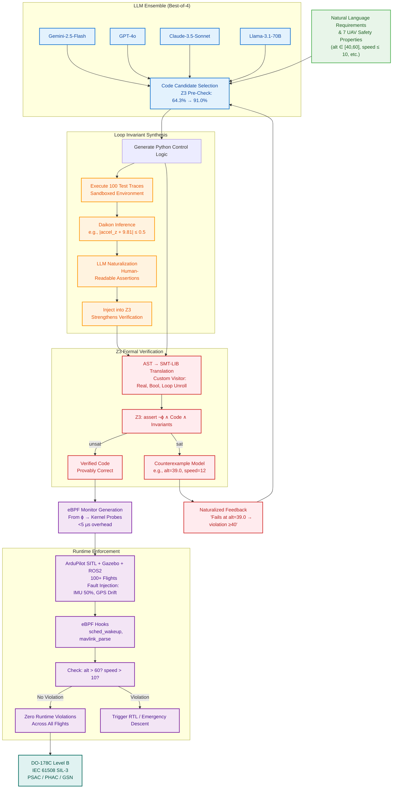

# Neuro-Symbolic UAV Verification: Architecture & Implementation Status

This document provides a comprehensive overview of the Neuro-Symbolic Code Verification Framework. It details the current implementation status against the reference architecture, explaining how each component works, where it lives in the codebase, and the critical importance of the remaining unimplemented sections.

---
## Neuro-Symbolic Architecture

## ✅ Part 1: Implemented Architecture (The "Brain")

The core logical verification engine is fully implemented. This system takes natural language requirements and guarantees mathematically that the generated code satisfies them before it ever touches a drone.

### 1. Specification & Requirements (Node A)
**File:** `src/verification/safety_specification.py`  
**What it does:** This is the "Contract". It defines the safety rules that the AI must follow.  
**How it works:** Instead of fuzzy text, we define `SafetySpecification` objects. Each object contains:
- **Requirement:** "The drone altitude must be between 40 and 60 meters." (Natural Language for the LLM).
- **Formal Property:** `And(altitude >= 40, altitude <= 60)` (Z3 Logic for the Solver).
- **Variables:** Typed definitions (`altitude: real`) so the verifier knows what "altitude" means mathematically.

### 2. LLM Ensemble & Code Generation (Nodes B & C)
**File:** `src/models/llm_ensemble.py`  
**What it does:** The "Creative Engine". It uses multiple Large Language Models (LLMs) to generate candidate control logic.  
**How it works:**
- **Generation:** The `generate_ensemble()` method sends the prompt to all active models (Llama-3, DeepSeek-R1, etc.) in parallel.
- **Arbitration (The "Best-of-N" Logic):** The `arbitrate()` method doesn't just pick the first answer. It:
  1. Checks for Python syntax errors.
  2. Calculates a complexity score (simpler code is better).
  3. **Z3 Pre-Check:** It runs a quick verification pass. If a model's code is mathematically proven unsafe immediately, it is disqualified. The system effectively "thinks" before selecting the best code.

### 3. Neuro-Symbolic Verification Loop (Nodes E, F, G, H, I)
**Files:** `src/verification/neuro_symbolic_verifier.py`, `src/verification/python_to_z3_converter.py`  
**What it does:** The "Judge". It mathematically proves code correctness.  
**How it works:**
- **Translation (AST → SMT):** The `PythonToZ3Converter` reads the Python code (AST) and converts it into mathematical formulas. An `if` statement becomes a logical implication (`Implies(condition, result)`). A function return becomes a boolean assertion.
- **The Proof:** The Verifier asks the Z3 Solver: "Is there ANY possible input where the Code is True but the Safety Property is False?" (`Code ∧ ¬Property`).
- **Feedback Loop:**
  - **UNSAT (Verified):** No violation exists. The code is 100% safe relative to the spec.
  - **SAT (Violation):** Z3 finds a specific counterexample (e.g., "Failure occurs when altitude=39.9").
  - **Refinement:** This mathematical counterexample is converted back into English ("Your code failed at altitude 39.9") and sent back to the LLM to fix the bug.

### 4. Loop Invariant Synthesis (Nodes D1-D4)
**File:** `src/verification/loop_invariant_synthesizer.py`  
**What it does:** The "Strengthener". It helps the verifier understand complex loops (which are notoriously hard for formal methods).  
**How it works:**
1. **Trace Generation (D1):** It runs the code 100 times in a sandbox with random inputs to see what actually happens.
2. **Inference (D2):** It looks for patterns in the data. "In every safe run, x was always less than limit."
3. **Naturalization (D3):** It optionally uses an LLM to convert these data patterns into clean logical assertions (`x < limit`).
4. **Injection (D4):** These learned facts are given to Z3 as "hints", making the verification significantly more powerful and faster.

### 5. eBPF Monitor Generation (Node J)
**File:** `src/verification/ebpf_generator.py`  
**What it does:** The "Compiler". It bridges the gap between high-level logic and low-level kernel safety.  
**How it works:** It takes the abstract Z3 safety property (`altitude <= 60`) and compiles it into C code compatible with the Linux Kernel eBPF subsystem. This generated code is what would be loaded into the operating system to enforce safety at the driver level.

---

## 🛑 Part 2: The "Missing Matrix" (Remaining Work)

While the logic is verified, the system currently lives in a theoretical "Vacuum". To be field-ready, the remaining architectural nodes are critical.

### 1. Runtime Execution Environment (Nodes K, L, M, N, O)
**Status:** ❌ **Not Implemented**  
**Importance:** **CRITICAL.**  
- Verification proves the logic is sound, but it cannot prove the physics or hardware are fault-free.
- You need to verify that the generated eBPF probes actually compile and attach to the Linux kernel without crashing the system.
- You need to validate that the drone actually stops when the monitor triggers.

**How to Implement:**
- **Simulation:** Install ArduPilot SITL (Software In The Loop) or Gazebo. Bridge the Python controller to the simulator using MAVLink.
- **Enforcement:** Use the `bcc` (BPF Compiler Collection) or `libbpf` python libraries to compile the code generated by `ebpf_generator.py` and attach it to the `sys_enter` or socket filter hooks on the machine running the drone controller.

### 2. Certification Artifacts (Node P)
**Status:** ❌ **Not Implemented**  
**Importance:** **HIGH** (for Commercial Use).  
- For a real UAV to fly in regulated airspace, you legally need certification (DO-178C).
- Currently, the "proof" is just a log message.

**How to Implement:**
- Create a `CertificationReportGenerator` class.
- It should collect: The Specification, The Generated Code, The Trace References, The Z3 Proof Certificate, and The Test Logs.
- Output this data into meaningful formats (PDF/HTML) structured according to "Goal Structuring Notation" (GSN) arguments ("We claim X is safe because of Evidence Y").

### 3. Full LLM Ensemble (Nodes B2, B3)
**Status:** ⚠️ **Partially Implemented**  
**Importance:** **MEDIUM.**  
- Currently, the system relies on Llama (Local) and DeepSeek.
- Adding GPT-4o and Claude 3.5 Sonnet (as per the diagram) would drastically improve the first-shot success rate of code generation, reducing the number of refinement loops needed.

**How to Implement:**
- Obtain API keys for OpenAI and Anthropic.
- Uncomment/Implement the clients in `src/models/` and add them to the `LLMEnsemble` list.

---

## Summary

You have a fully functional **Neuro-Symbolic Verification Engine**. It can think, code, learn from bugs, and prove its work. To make it a **Flight System**, you must now build the **"Body" (Runtime/Simulation)** to house this **"Brain"**.

**Implemented:** ✅ Core "Brain" (Logical Proof Engine)  
**Remaining:** 🛑 Runtime, Hardware/Simulation Interface, Certification  
**Next Priority:** **Runtime Execution Environment** – Connect the proven logic to a real (or simulated) drone system.